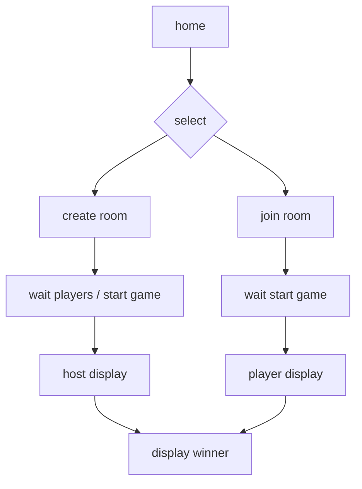

## Hi there!

The objective of this project was to learn how to use web sockets and how to create a multiplayer game. It was created using Next.js, React and Sockets.io. You can check it out [here](http://bingo-oandre.herokuapp.com/en) or [here](http://bingo-oandre.herokuapp.com/) for the Portuguese version. Feel free to modify as you wish.

If you want the logic of the game bingo, go to utils → bingo.js.


## Getting Started

First, run the development server:

```bash
npm install
npm run dev
```

Open [http://localhost:3000](http://localhost:3000) with your browser to see the result.

You can start editing the page by modifying `pages/index.js`. The page auto-updates as you edit the file.

## Example

You can create a room where multiplayers can join to participate:


Changes will reflect on all participants' screens in the room:


## FlowChart


